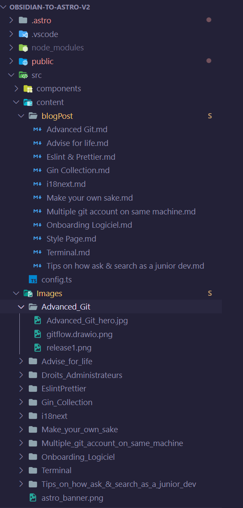

# Zettlekasten to Astro
© 2021 Guillaume Excoffier. All rights reserved.
## 🧾Context

This project have the goal of exposing my obsidian notes to the web. The idea of developping such a tool came to me when i saw a video of [Takuya Matsuyama](https://github.com/craftzdog) :

[](https://www.youtube.com/watch?v=3_JE76PKBWE)

## 📚Stack

- 🚀[Astro](https://astro.build/) - Astro is an **all-in-one** **web framework** for building **fast,** **content-focused** websites.
- ⚛[React](https://beta.reactjs.org/) - A JavaScript library for building user interfaces
- ⌨[Tailwind](https://tailwindcss.com/) - Rapidly build modern websites without ever leaving your HTML.

## 📁Project Structure

Inside of your Astro project, you'll see the following folders and files:

```
├── public/
│   └── Images/
│        ├──[Project_1]
│        │       ├──Image1.png
│        │       └──Image2.png
│        ├──[Project_2]
│        └──[Project_n]
├── src/
│   ├── components/
│   ├── layouts/
│   └── pages/
│    	└── Obsidian-Posts
│               └──Project_1.md
├── astro.config.mjs
├── README.md
├── package.json
└── tsconfig.json
```

Astro looks for `.astro` or `.md` files in the `src/pages/` directory. Each page is exposed as a route based on its file name.

Each `.md` file have a dedicated folder in the `public/Images` folder where you can store your static assets so that those dont get mixed up.

## 🧞 Commands

All commands are run from the root of the project, from a terminal:

| Command                | Action                                           |
| :--------------------- | :----------------------------------------------- |
| `npm install`          | Installs dependencies                            |
| `npm run dev`          | Starts local dev server at `localhost:3000`      |

## 🚀Deploying

I would advide to push your code to your own git repository. 
I used [Vercel](https://vercel.com/dashboard) to deploy. It is a free & easy to setup option as long as you are not using your website for commercial use. 

## Obsidian Setup 

As I couldn't figure out other way arround for now, the workflow to push from a local obsidian vault to this exposed astro blog can get a bit hard. Which is why I will provide some help on how to setup.

Inside your vault, a few folders will be usefull. Be careful to follow the structure **EXACTLY** or else it might not work.

```
Upload_Script.ps1
[Vault name]
    ├── Images/
    │        ├──[Project_1]
    │        │       ├──Image1.png
    │        │       └──Image2.png
    │        ├──[Project_2]
    │        └──[Project_n]
    ├── Permanent Notes/
    │        └──Project_1.md
    └── Templates/
             └──Permanent Note Template.md        
```

### Permanent Note Template

This template will have to be added to every note you wich to expose. It will let astro parse the metadata to create the adequate pages & corresponding images once deployed :

```md
---
 
layout: '../../layouts/BlogPost.astro'
title: {{title}}
description: 
date: {{date}} {{time}}
tags: 
- 
heroImage: /Images/{{title}}/{{title}}_hero.png

---

# {{title}}


#### References
Tags : #

```

Once you have your template you wont need to touch it.


### Creating a New Post

- Inside the Permanent Note folder, create the new file & use the template.
- Create a folder that have the same name as your new note in the Images folder at the root of you vault. 
  - ⚠️Make sure to not use space and replace them with `_` ⚠️
- Make some modification to the auto generated metadatas. 
  - Description
  - tags
  - heroImage ( Image that will be used to illustrate your topic)
    - Make sure to change the path name to correspond to your image folder of this note ! 

Below is an example of post, yours should have a similar structure :


Every time you wish to refer to an image for the page, your will have to follow this structure :

`/Images/[Project_name]/[Image_name]` 

It will be important once it is deployed to Astro.


## Manual Method

Copy files manually in the `Images` and `Obsidian-Posts` in the astro project. you can then push your changes to your remote repository and it will add the new content to your website !

⚠️Your obsidian vault folder should always be synchronized with your astro project so that you dont loose data ⚠️

With our example our **astro** project should ressemble like this :



```bash
git add .
git commit -m "Your new message"
git push origin main
```

## Git Setup (Optional)

This next part require advance knowledge of git and how git sub-repository works. 
I would advise not to do this part unless you  want to automate copying your files and have a better control over versionning.

WIP

